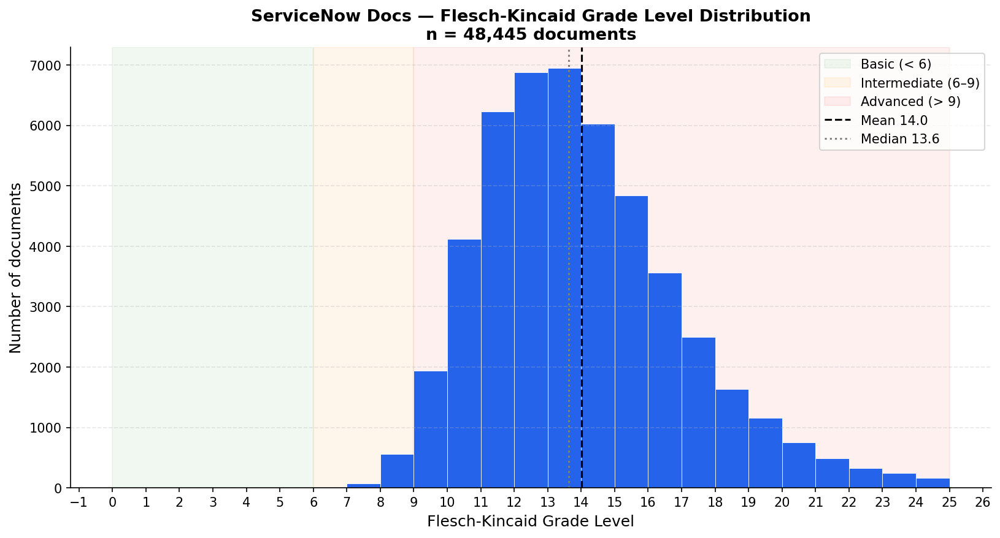
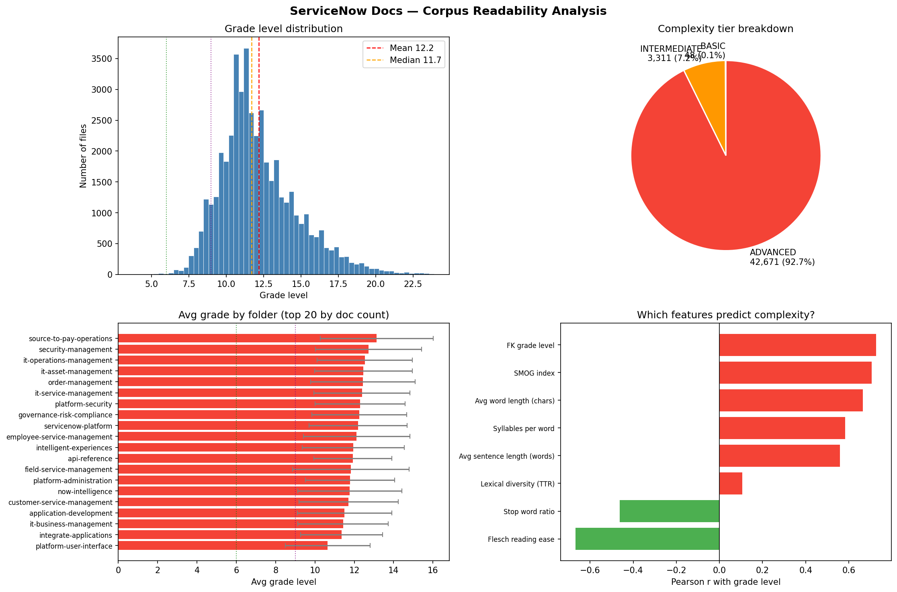
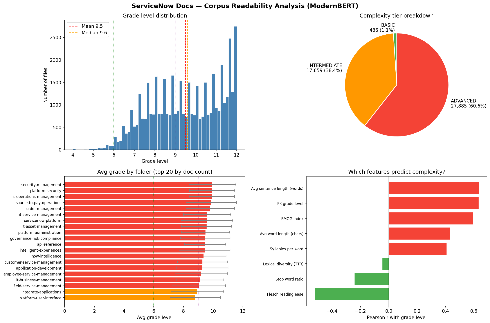
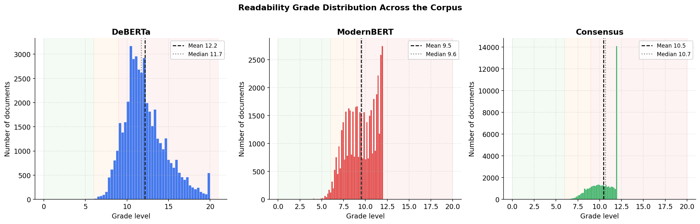
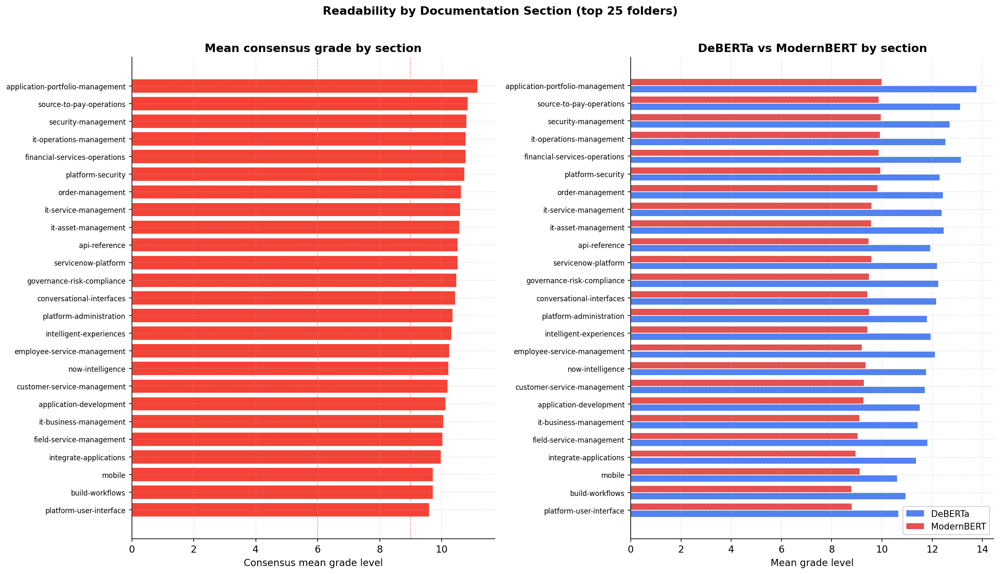
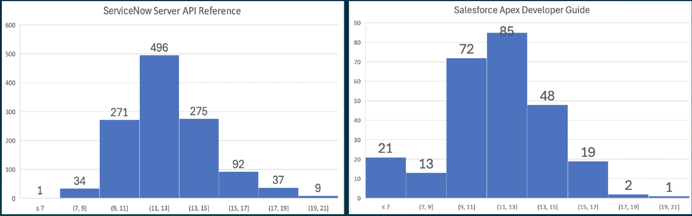

# Technical Documentation Quality Analysis Using Transformer-Based NLP Models

## Overview

This project analyzes the readability and linguistic complexity of the publicly available ServiceNow documentation corpus using traditional readability metrics and transformer-based NLP models.

The [ServiceNow documentation repository](https://github.com/ServiceNow/ServiceNowDocs) provides approximately 46,000 Markdown files, enabling large-scale corpus analysis of enterprise technical documentation.

The goal of this project was to investigate whether automated language models can provide scalable methods for assessing documentation quality.

Research questions:

- What reading level is required to understand enterprise software documentation?
- Do traditional readability formulas agree with transformer-based readability models?
- Can automated NLP methods identify documentation areas requiring editorial attention?

The answer is **yes**.

---

## Dataset

## Data Source

**Corpus:** ServiceNowDocs public GitHub repository
**Format:** Markdown documentation files  
**Size:** ~46,000 documents  
**Source:** https://github.com/ServiceNow/ServiceNowDocs

The repository contains ServiceNow product documentation formatted as Markdown and made available for AI/LLM consumption. 

Advantages of this corpus:

- Large-scale collection of real-world software documentation
- Consistent Markdown structure
- Enables automated corpus-level analysis

We likewise compared the analysis against a competitor SalesForce. This is discussed in the X section.

---

# Methodology

## Traditional Readability Metrics: Flesch-Kincaid Grade Level

The analysis began with an established rule-based readability method. Flesch-Kincaid estimates educational reading level using surface-level linguistic features such as:

- sentence length
- word length
- syllable count

Using the Python package `textstat`, readability scores were calculated across the documentation corpus.

**Code**: [Flesch_Kincaid_on_ServiceNow](notebooks/Flesch_Kincaid_on_ServiceNow.ipynb)

# Transformer-Based Readability Models

Two transformer-based readability models were evaluated. These models use deep-learning representations of language rather than manually defined readability formulas.

## ModernBERT Readability Model

- Produces readability grades from approximately 1–12
- Trained on datasets containing software-related documentation
- Expected to provide strong alignment with technical documentation

Model on HuggingFace: [kiddom/modernbert-readability-grade-predictor](https://huggingface.co/kiddom/modernbert-readability-grade-predictor)

**Source code**:

## DeBERTa Readability Model

- Produces a wider readability range extending beyond high school levels
- Captures documents requiring college-level reading ability

Model on HuggingFace: [gentlans/deberta-v3-base-readability-v2](https://huggingface.co/agentlans/deberta-v3-base-readability-v2)

**Source code**:

---

# Results

## Traditional Readability Analysis

Flesch-Kincaid analysis showed that most documentation requires a high school education or above. The scores showed a normal distribution hovering around a `13th-14th'' grade education, meaning late high school or early college education.

This result aligns with expectations for software documentation, which is primarily written for technical audiences.

---

## Transformer Model Agreement

The two transformer models produced strongly correlated results.

General findings:

- Documents rated difficult by one model were generally rated difficult by the other.
- Documents rated easier by one model were generally rated easier by the other.
- Transformer-based scores also correlated with traditional Flesch-Kincaid measurements.

These results suggest that automated readability models capture meaningful patterns in technical documentation complexity.

---

## ModernBERT vs. DeBERTa

The two models differ in scoring behavior:

### DeBERTa

- Produces a broader range of readability grades
- Captures documents extending into college-level difficulty
- Provides greater granularity for highly technical documents

### ModernBERT

- Produces a narrower grade range
- Has training data more closely aligned with software documentation
- May provide better domain-specific estimates for technical content

Overall, both models identified similar relative difficulty patterns across documents.

### Two BERTs Together

The two BERT models also generally agree with each other.

We took the average of the two BERT scores (1-12 and 1-20) and the result looks visually the same as the (1-12) system

---

# Statistical Analysis

Multiple statistical comparisons were performed between:

- ModernBERT readability scores
- DeBERTa readability scores
- Flesch-Kincaid scores

The analyses showed strong correlations between:

- transformer-based readability predictions
- traditional readability metrics
- the two transformer models themselves

This suggests that transformer-based approaches can provide scalable alternatives to traditional readability analysis.

---

# Applications

## Documentation Quality Monitoring

Automated readability analysis can help identify:

- documentation areas with unusually high complexity
- bundles requiring editorial review
- opportunities for improving content accessibility

For example, application-development documentation showed some of the highest complexity scores, which is expected given the technical expertise required by the target audience. In contrast, mobile documentation was rated among the easiest to read, which makes sense because they typically use a simple task structure.

---

## Competitive Documentation Analysis

The same methodology could be applied to competitor documentation.

However, comparable analysis is limited by data accessibility. Some platforms do not provide complete documentation repositories for bulk analysis.

A possible future direction would be targeted comparisons of specific documentation bundles. For example, we evaluated Server API Reference documentation from the ServiceNow repository against the Apex Developer Guide documentation of a competitor SalesForce. The competitor's documentation was downloaded as a PDF from the SalesForce documentation website.

**Competitor site**: https://resources.docs.salesforce.com/latest/latest/en-us/sfdc/pdf/salesforce_apex_developer_guide.pdf

* ServiceNow “Server API Reference” : 1215 MDs, average 12.4
* Salesforce ” Apex Developer Guide” : 261 MDs, average 11.3
* Comparable and the 1 grade level difference could just be because of doc size

---

# Future Work and Impact

Potential extensions:

- Validate automated readability scores against human editorial ratings
- Analyze readability changes over documentation versions
- Combine readability with other quality metrics:
  - terminology consistency
  - documentation freshness
  - search success
  - user feedback
- Develop AI-assisted documentation quality scoring workflows

The most obvious use case is to combine readability metrics with page views, document age, and project priorities. For example:
- Is a document complex but gets high page views?

--> The documentation team should focus on improving those documents' readability because this document is high-usage.
- Is a document complex but has high bounce rate?

--> People stop reading the document because it's too hard.
- Is a document complex and LLMs struggle at retrieving information from it?

--> The document's structure is not designed for easy automated retrieval.
  

In sum, this analysis provides a scalable approach for prioritizing editorial review and identifying documentation improvement opportunities.

---

# Technologies

- Python
- NLP
- Transformer models
- Hugging Face ecosystem
- Text analytics
- Corpus linguistics
- Statistical analysis
- Data visualization
